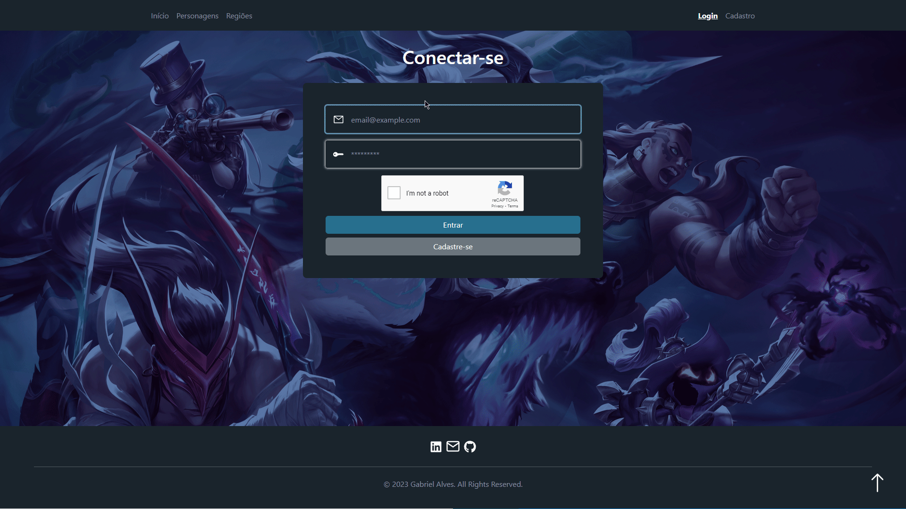
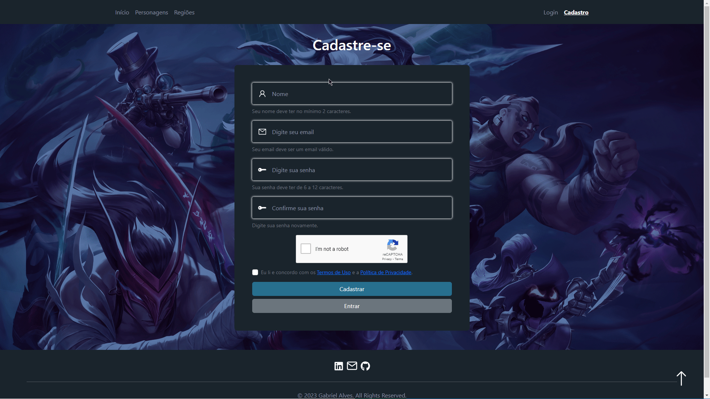
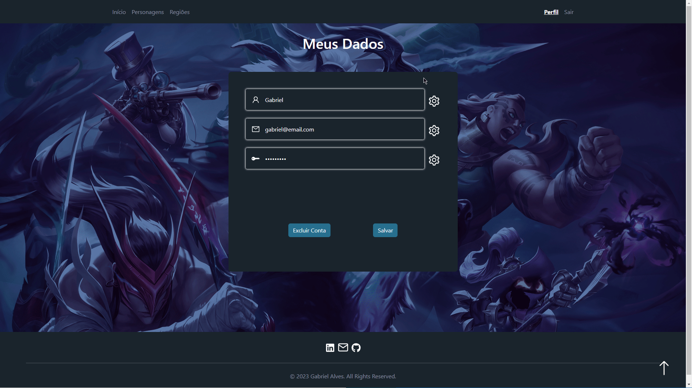
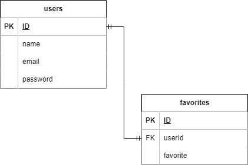

# Personal Project 1 - League of legends

---

## Sumário

- [Tecnologias Utilizadas](#tecnologias-utilizadas)
- [Projeto](#projeto)
  - [Home](#home)
  - [Champion](#champion)
  - [Champion Details](#champion-details)
  - [Region](#region)
  - [Region Details](#region-details)
  - [Login](#login)
  - [Register](#register)
  - [Profile](#profile)
  - [Profile Edit](#profile-edit)
  - [Diagram](#diagram)
- [Clonando Repositório](#clonando-repositório)
- [Instalando Dependências](#instalando-dependências)
- [Executando Aplicação](#executando-aplicação)

---

## Tecnologias Utilizadas

- JavaScript
- React
- Bootstrap
- Google Recaptcha
- Jest
- Node.js
- Express.js
- Sequelize
- MySQL2
- Bcrypt
- Jwt
- Mocha
- Chai
- Sinon

---

## Projeto

### Home

Tela inicial com 2 opções, navegar para personagens ou regiões


### Champion

Lista dos personagens, opção de favoritar, campo de busca, botões de filtro e ao clicar em algum personagem será redirecionado para os detalhes deste personagem


### Champion Details

Detalhes do personagem selecionado


### Region

Lista das regiões com campo de busca e ao clicar em alguma região será redirecionado para os detalhes desta região


### Region Details

Detalhes da região selecionada


### Login

Tela de login



### Register

Tela de registro



### Profile

Perfil com nome e email, opção de editar perfil e a lista dos personagens favoritos


### Profile Edit

Opções de editar o nome, email ou senha e de deletar o usuario



### Diagram

Diagrama do banco de dados



---

## Clonando Repositório

- Clone o repositório

  ```sh
    git clone git@github.com:xitusz/personal-project-1.git
  ```

---

## Instalando Dependências

- Entre na pasta do repositório que você clonou:

  ```sh
    cd personal-project-1
  ```

- Instale as dependências

  ```sh
    npm run install-all
  ```

---

## Executando Aplicação

- Entre na pasta do repositório que você clonou:

  ```sh
    cd personal-project-1
  ```

- Inicie o projeto:

  ```sh
    npm start
  ```

- Acesse o endereço em seu navegador:

  ```sh
    http://localhost:3000/
  ```

---
